# fractal-art

A Python package for generating 512x512 fractal art PNG images using common scientific Python tools:

- `scipy`
- `matplotlib`
- `scikit-image`

The generator combines multiple fractal families (`Mandelbrot`, `Julia`, `Burning Ship`, `Tricorn`, and `Newton`) and composites cropped fractal elements (for example tree sprites) into layered scenes with natural color palettes, horizons, lakes, reflections, stars, galaxies, and ringed planets.

## Installation

```bash
pip install -e .
```

## Create your own fractal art

Generate one image:

```bash
fractal-art --theme landscape --style neon --seed 42 --output my_art.png
```

Options:

- `--theme`: `landscape`, `tree`, `planet`, `nebula`, `ocean`
- `--style`: `classic`, `neon`, `pastel`, `mono`
- `--seed`: integer random seed for reproducible variations
- `--size`: must be `512`
- `--output`: output PNG path

Generate a full set of 20 examples:

```bash
fractal-art --gallery --gallery-dir examples
```

## Python API

```python
from fractal_art import generate_art

generate_art(
    "my_planet.png",
    theme="planet",
    style="pastel",
    seed=123,
    size=512,
)
```

## 20 example artworks

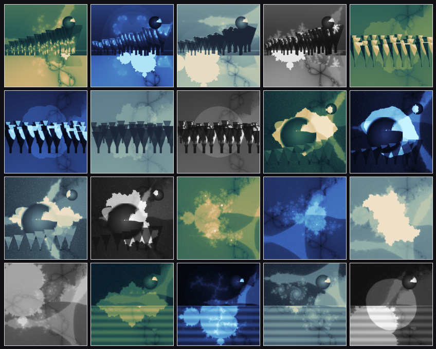

| # | Preview |
|---|---|
| 1 | 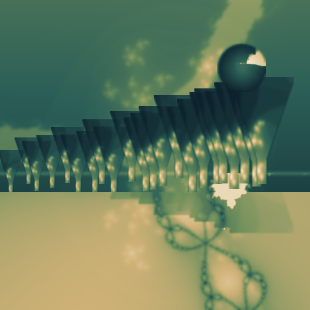 |
| 2 | 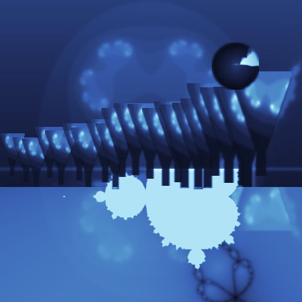 |
| 3 | 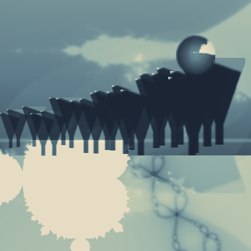 |
| 4 | 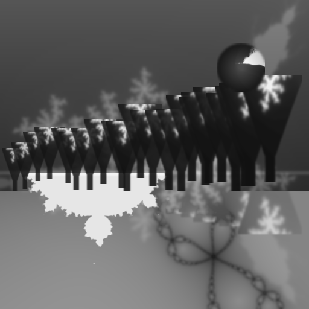 |
| 5 | 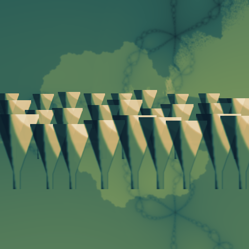 |
| 6 | 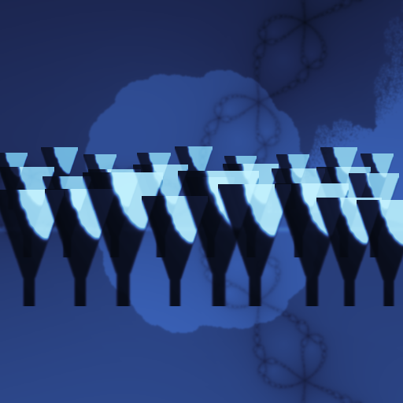 |
| 7 | 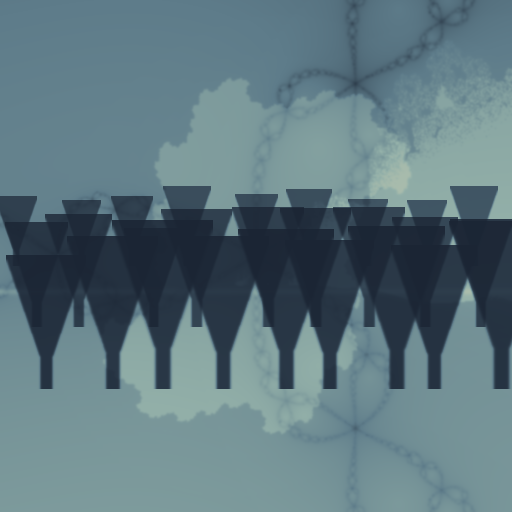 |
| 8 | 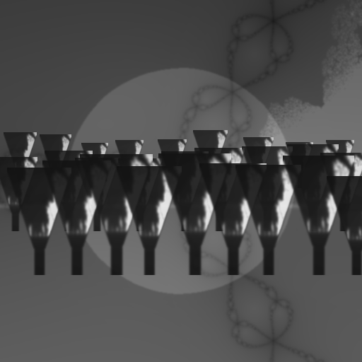 |
| 9 | 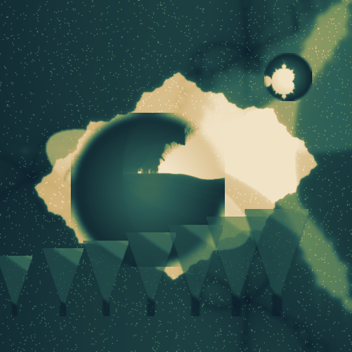 |
| 10 | 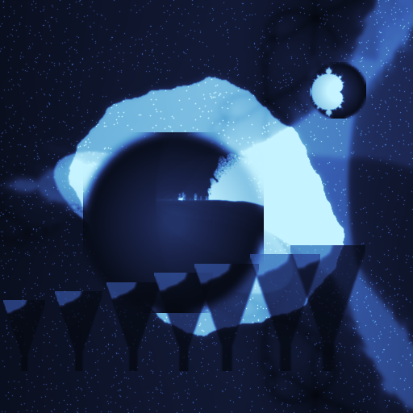 |
| 11 | 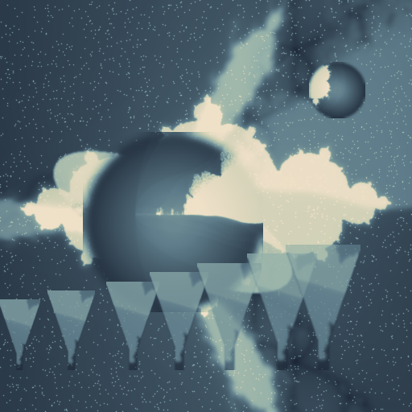 |
| 12 | 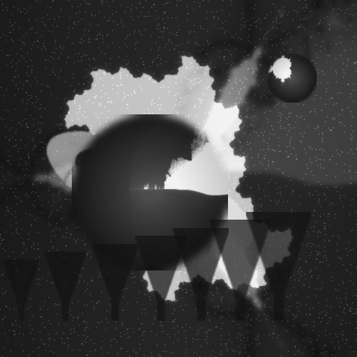 |
| 13 | 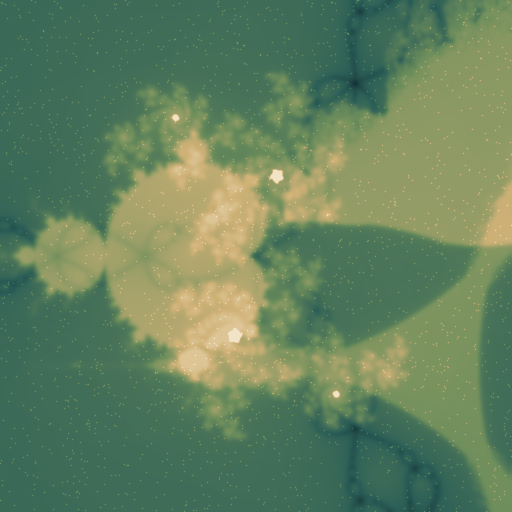 |
| 14 | 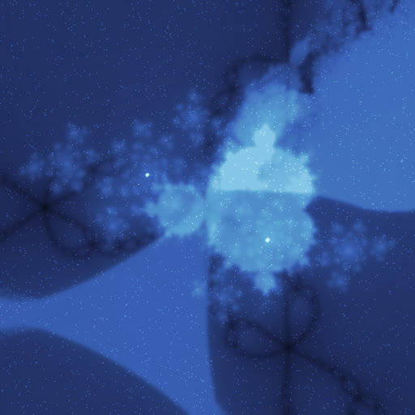 |
| 15 | 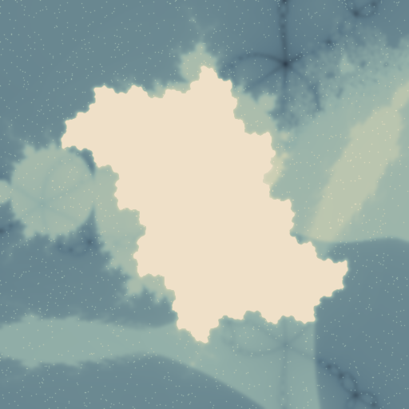 |
| 16 | 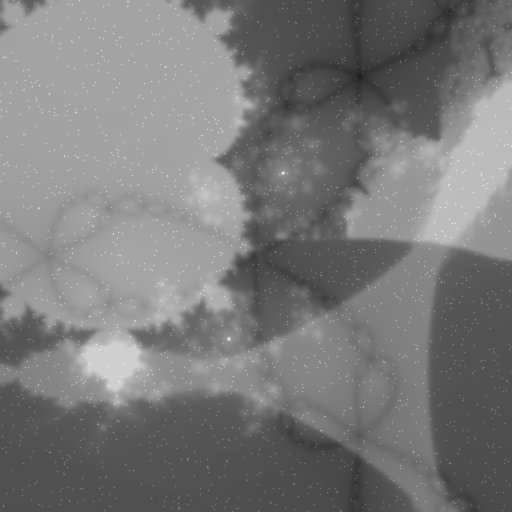 |
| 17 | 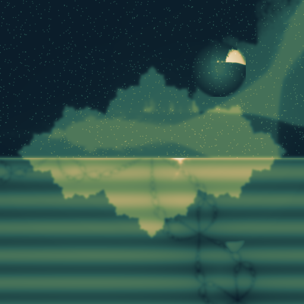 |
| 18 | 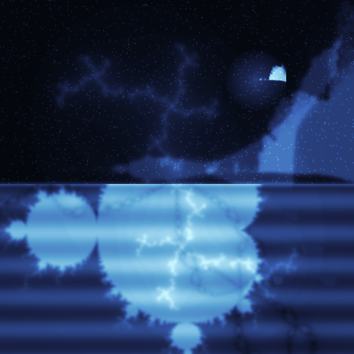 |
| 19 | 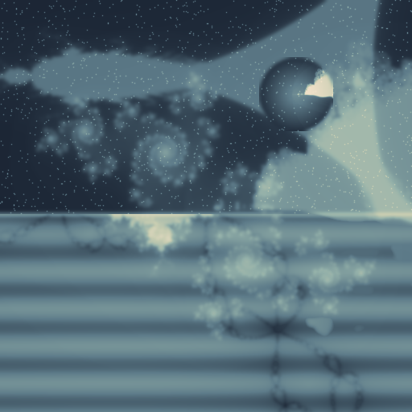 |
| 20 | 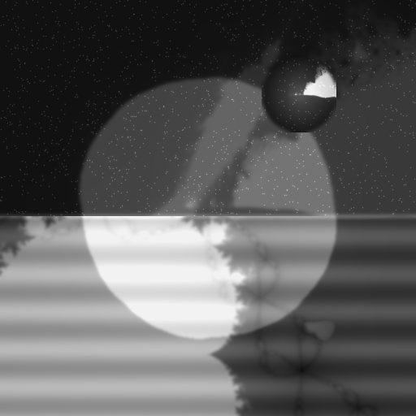 |
